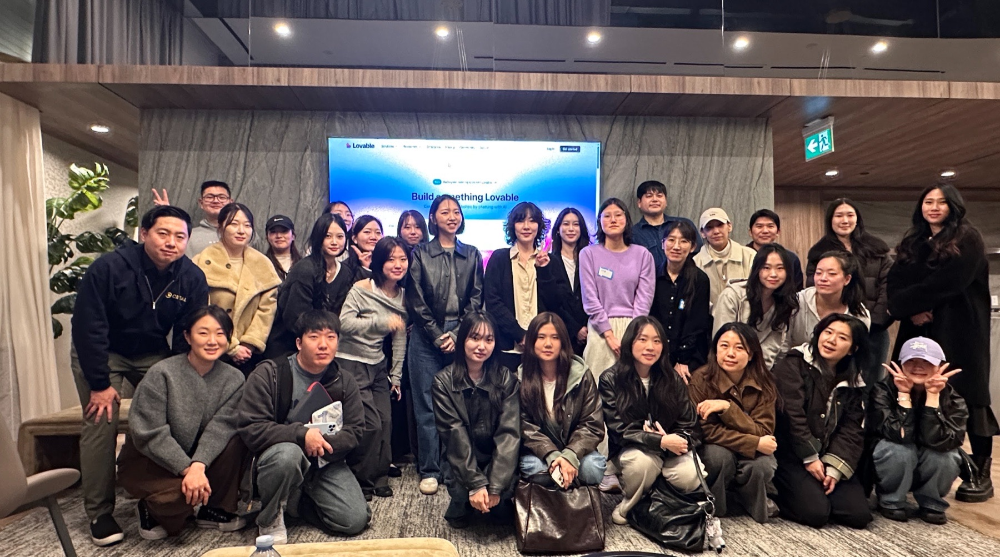
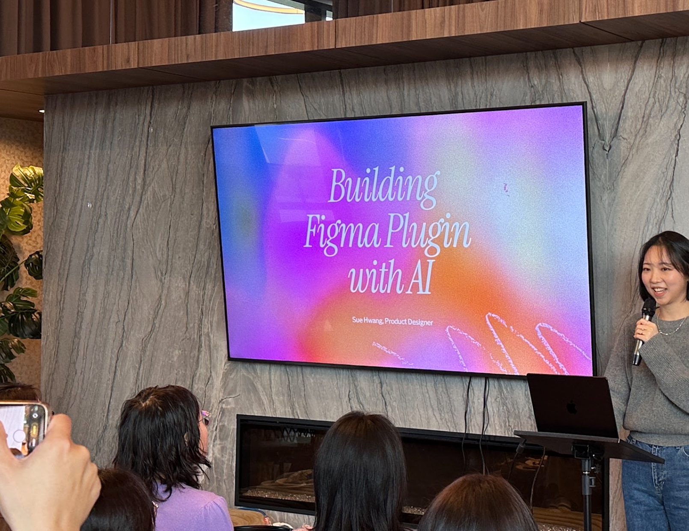
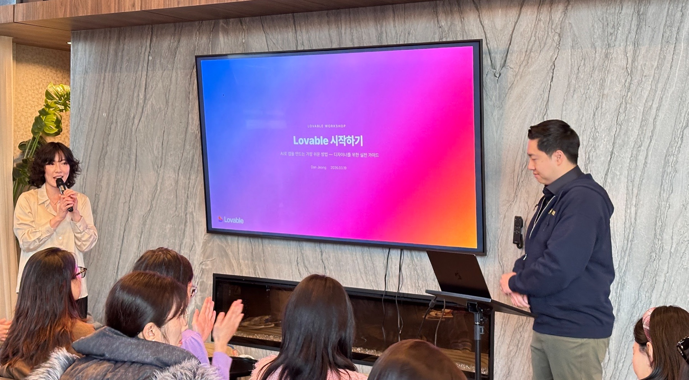
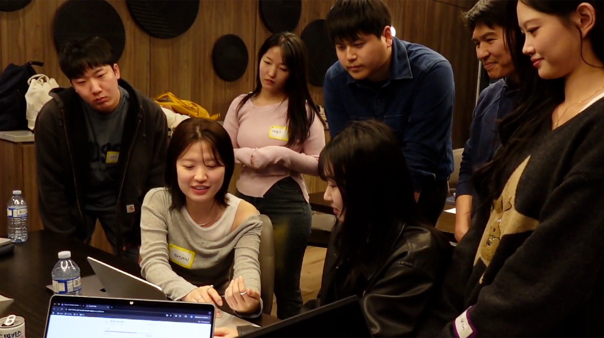

# AI & Design: New Workflows with Lovable — An AI Hackathon & Meetup for Designers

I co-hosted a sold-out Korean-language workshop and mini hackathon for 40 designers in Metro Vancouver. I helped connect practitioner workflows, a live Lovable build, and a 90-minute team challenge. The speed was useful, but what it revealed about problem framing mattered more.

**Event**  
AI & Design · Lovable mini hackathon

**Location and date**  
Burnaby, BC · March 22, 2026

**Role**  
Co-host · Workshop design · Community facilitation

**Official event**  
[View the event on Luma](https://luma.com/qsr14jq6)

## Designers needed a place to try, not another AI overview

AI was already part of nearly every design conversation around us. The practical question was different: where could a designer try vibe coding, understand the workflow, and build something without already knowing how to code?

Many meetups we encountered were organized around engineering workflows. So Eun Ahn and I instead planned a Korean-language event around the work designers already do: define a problem, shape an experience, build a prototype, and explain the decisions behind it.

The event filled all 40 spots, with KDNEW, Lovable, and Canbu joining as partners. As a co-host, I linked the talks, hands-on workshop, team build, and demos so participants could move from watching a workflow to testing one themselves.

## We made the workflow visible before asking anyone to build

We did not open a blank prompt box and tell everyone to start. The first half of the event made three parts of an AI-enabled design workflow visible.

So Eun shared how designers can use Git and a shared codebase to collaborate more closely with engineers and with one another. Sue Hwang walked through how she built a Figma plugin with Claude and Codex, step by step, as a designer. Dan Jeong then moved from explanation to a live Lovable build, showing how a prompt becomes an editable product flow.

Each participant received 100 Lovable credits in advance. Then we formed random teams of three and gave them 90 minutes to choose a problem, define one core experience, and make it work well enough to share. The talks were not a preface to the hackathon. Each one supplied a method participants could use in the build.

## Working prototypes made the product questions visible

Crystal Park and Leiah Choi won the mini hackathon with Sircle, a dating service for seniors. Instead of starting with faster matching, they started with a more useful question: how can an older adult know that a new connection is safe and trustworthy?

Another team built an English-learning app for newcomers that paired practical phrases with Canadian cultural context. Other teams created a community meal-prep platform and an affirmation app that kept social media locked until the user spoke the phrase correctly.

These were not finished products, and we did not evaluate them as if they were. Once each team had enough of a working experience to show the user, problem, and core interaction, they could see which parts of the idea were clear and which still relied on assumptions.

## The room changed when teams started sharing

At the beginning, people stayed close to their own laptops. Halfway through, they were standing behind other teams, comparing flows, fixing prompts, and explaining what had worked. The room felt less like a class and more like a temporary product studio.

Survey comments also mentioned the pacing, venue, food, coffee, and credits provided in advance. Those details did not teach the tool, but they reduced friction and helped people stay with the workshop.

A job seeker who had worried about keeping up with working professionals completed the build. People who had never used Lovable made functional prototypes. Experienced designers openly shared how they were using AI in real work. These were concrete signs that the format worked for participants with different starting points.

Feedback reinforced the same pattern. Participants valued seeing real workflows, building within a clear time limit, and learning alongside people with different levels of experience.

## What still required a designer's judgment

AI clearly changed the speed of the work. In the strongest demos I saw, however, speed followed a specific user, a real tension, and one interaction worth testing. A clever prompt could not compensate for a vague problem.

Participants completed a full loop: see a workflow, choose a problem, build with others, and share unfinished work. They did not need to leave as AI experts. The useful outcome was knowing they could start—and seeing where their own judgment still had to lead.

That is the standard I want to carry into future AI workshops: make the tool accessible, make the work visible, and leave enough room for design judgment to be tested.
