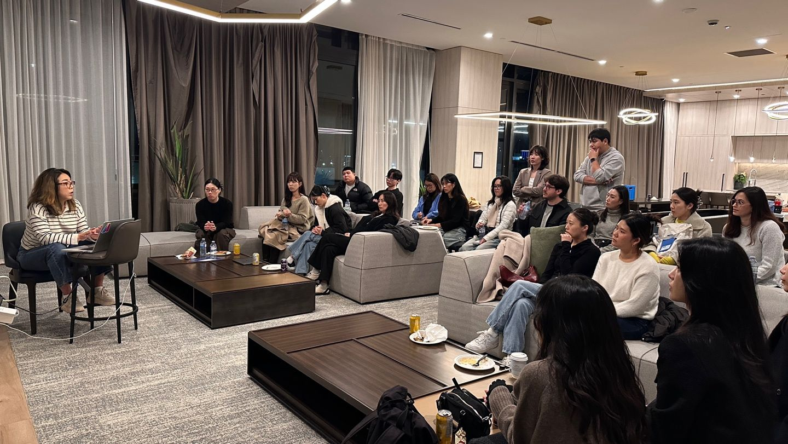
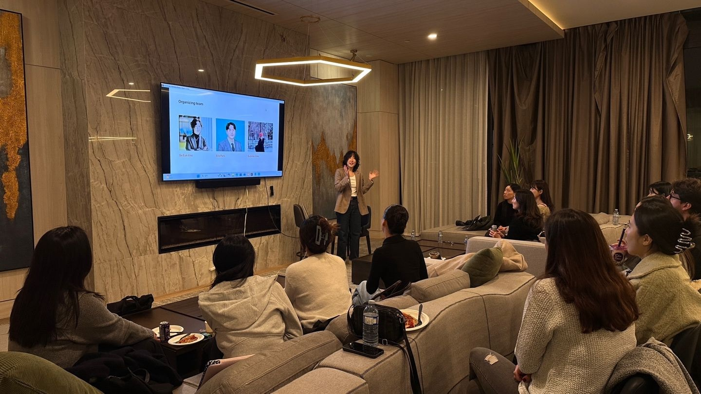
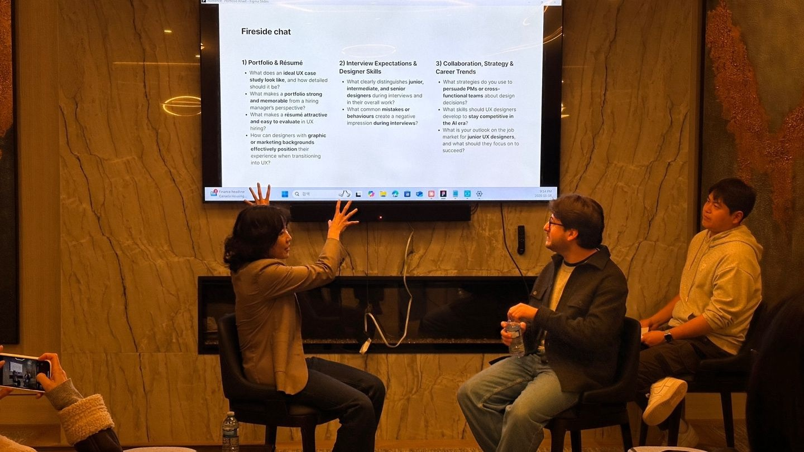

# Portfolio Roast: UX 디자이너를 위한 실전 포트폴리오 인터뷰 & 피드백 세션

운영팀으로 Portfolio Roast를 함께 준비했습니다. 버나비에서 열린 이 행사에는 20명 이상의 디자이너가 참여했습니다. 두 명의 디자이너가 Oracle의 Principal User Experience Designer인 Carlos Melendez에게 실제 케이스 스터디를 발표했고, 포트폴리오를 평가할 때 어떤 질문이 오가는지 참가자 모두가 볼 수 있었습니다.

**행사**  
Portfolio Roast · 실전 포트폴리오 모의 인터뷰

**장소 및 일시**  
Gilmore Place Tower 3, 버나비, BC · 2025년 11월 18일

**역할**  
운영팀 · 행사 운영 · 커뮤니티 퍼실리테이션

**공식 이벤트**  
[Luma 이벤트 보기](https://luma.com/6x1wh2bn)

## 잘 정리된 포트폴리오도 질문 앞에서는 흔들릴 수 있습니다

포트폴리오는 대부분 혼자 만듭니다. 몇 주 동안 케이스 스터디를 다듬어도 그 이야기가 상대에게 어떻게 들리는지는 실제 인터뷰가 시작되어야 알게 되는 경우가 많습니다.

Portfolio Roast는 그 순간을 실제 인터뷰보다 부담이 적은 자리에서 먼저 시험해보도록 만든 행사였습니다. 실제 케이스 스터디를 라이브 인터뷰 상황에 놓고, 그 자리에서 나온 질문과 피드백을 모두에게 열었습니다.

So Eun Ahn님이 게스트와 발표자, 커뮤니티를 한자리에 모았습니다. 저는 So Eun님, Suryeon Kim님과 운영팀으로 함께하며 프로그램 흐름을 정리하고 현장 운영을 도왔습니다. KDNEW는 이벤트 파트너로 함께했습니다. 공식 이벤트 페이지에는 25명이 참석자로 표시됐고, 행사 회고에서는 20명 이상의 디자이너가 함께했다고 확인했습니다.

## 슬라이드 리뷰 대신, 실제 인터뷰에 가깝게

Hayley Lee와 Sue Lee는 각자의 포트폴리오 케이스 스터디를 참가자들 앞에서 발표했습니다. Carlos는 실제 인터뷰어처럼 이야기를 듣고, 빠진 맥락을 질문하고, 어떤 부분이 작업을 이해하기 쉽게 만들거나 어렵게 만드는지 직접 피드백했습니다.

라이브 형식은 한 사람에게 주어진 피드백의 범위를 넓혔습니다. 화면은 잘 정리됐지만 결정의 이유가 더 필요한 지점, 결과를 뒷받침할 근거가 부족한 지점, 발표자가 맥락을 설명하자 비로소 이해되기 시작한 지점을 모두가 함께 볼 수 있었습니다.

## 파이어사이드 토크는 방금 본 작업에서 시작했습니다

발표가 끝난 뒤에는 개별 케이스 스터디를 넘어, 디자이너들이 인터뷰와 실제 업무에서 계속 마주하는 질문으로 대화를 넓혔습니다.

먼저 케이스 스터디에는 어느 정도의 디테일이 필요한지, 무엇이 작업을 기억에 남게 하는지, 그래픽 디자인이나 마케팅 경험을 UX 경력으로 어떻게 설명할지 이야기했습니다.

그다음에는 질문의 범위를 넓혔습니다. 주니어·인터미디어트·시니어를 나누는 기준, 인터뷰에서 부정적인 인상을 주는 행동, 크로스펑셔널 파트너에게 디자인 결정을 설명하는 방법, 어려운 채용 시장에서 무엇에 집중할지를 함께 다뤘습니다.

이 대화가 구체적으로 들린 데는 순서도 중요했습니다. 행사를 시작하자마자 추상적인 커리어 조언부터 꺼낸 것이 아니었습니다. 모두가 두 개의 실제 포트폴리오가 발표되고 질문받는 과정을 본 직후였기 때문에, 조언을 자신의 작업과 바로 연결해볼 수 있었습니다.

## 한 발표자에게 던진 질문을 모두가 함께 들었습니다

포트폴리오 피드백은 보통 리뷰어와 한 명의 디자이너 사이에서 끝납니다. 이번에는 20명 이상의 참가자가 같은 이야기를 보고, 같은 질문을 듣고, 자신의 작업과 비교할 수 있었습니다.

덕분에 행사장은 심사받는 자리보다 함께 포트폴리오를 살펴보는 세션에 가까워졌습니다. 발표자들은 아직 완벽하지 않은 이야기까지 기꺼이 꺼내놓았습니다. 참가자들은 집중해서 듣고 후속 질문을 던졌고, 공식 프로그램이 끝난 뒤에도 대화를 이어갔습니다.

행사 뒤 Sue님은 LinkedIn 회고에 Lento 프로젝트로 첫 단독 발표를 했다고 남겼습니다. 한 사람의 회고가 전체 참가자를 대표하지는 않습니다. 다만 다음 실제 인터뷰 전에 자신의 이야기를 부담이 덜한 자리에서 연습해볼 수 있었다는 한 가지 결과는 확인할 수 있었습니다.

## 포트폴리오 리뷰는 질문까지 이어져야 합니다

좋은 포트폴리오 리뷰는 화면을 더 매끈하게 만드는 조언에서 끝나면 안 됩니다. 다른 사람이 질문을 시작했을 때도 문제와 결정, 근거를 설명할 수 있는지까지 확인해야 합니다.

하나의 포트폴리오 템플릿을 만드는 것이 목적은 아니었습니다. 대신 인터뷰어가 무엇을 묻는지, 이야기에 어떤 근거가 필요한지, 맥락이 작업의 이해를 어떻게 바꾸는지를 모두가 볼 수 있게 했습니다.

운영팀으로서 중요하게 본 결과도 여기에 있습니다. 아직 완성되지 않은 이야기를 실제 질문 앞에 놓아보고, 직접 피드백을 들은 뒤, 다음에 무엇을 연습할지 정할 수 있는 자리를 만드는 것입니다.
